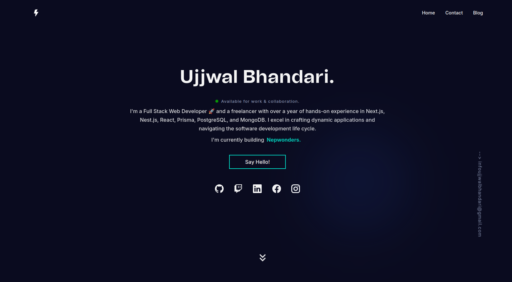

# ujjwall.com.np

Welcome to my portfolio website showcasing my projects, skills, and experience.

---

## 🚀 Tools & Technologies

### Frontend


### Backend


### State Management & Validation


### Utilities & Libraries

- **Animations:** Framer Motion
- **Icons:** React Icons & Lucide React
- **Form Validation:** React Hook Form & Zod
- **Carousel:** Embla Carousel
- **Notifications:** React Hot Toast
- **SEO & Sitemap:** Next-Sitemap

---

## 📸 Screenshots



---

## 🛠️ Features

- **Responsive Design:** Optimized for all devices—desktop, tablet, and mobile.
- **Authentication:** Secure user login and management with `next-auth`.
- **Animations:** Smooth and interactive transitions using Framer Motion.
- **Reusable Components:** Built with Radix UI for modular and customizable components.
- **Type Safety:** Enforced with Zod for validation and TypeScript.
- **SEO Ready:** Includes automated sitemap generation with `next-sitemap`.

---

## 🚀 Getting Started

### Prerequisites

- Node.js (v20 or higher)
- bun

### Installation

```bash
# Clone the repository
git clone https://github.com/ujjwalbhandarii/ujjwall.com.np

# Navigate to the project directory
cd ujjwall.com.np

# Install dependencies
bun install

```

### Development Server

```bash
# Run the development server
bun run dev
```

Open [http://localhost:3000](http://localhost:3000) to view the website.

### Build for Production

```bash
# Build the application
bun run build
```

### Start the Production Server

```bash
bun run start
```

## 📄 License

This project is licensed under the [MIT License](LICENSE).

## 🤝 Contact

- **Email:** infoujjwalbhandari@gmail.com
- **LinkedIn:** [linkedin.com/in/ujjwalbhandarii](https://www.linkedin.com/in/ujjwalbhandarii/)
- **Portfolio:** [ujjwall.com.np](https://www.ujjwall.com.np/)

---

Thank you for checking out my portfolio website! Feel free to reach out for collaborations or inquiries. 🚀
